# LAB-9-Upgrade-Router-OS-Downgrade-Router-OS-Package-management-extra-packages-Manajemen-Package
Rabu 13 Agustus 2025

**Siswa mampu melakukan :**  
- Upgrade Router OS,  
- Downgrade Router OS,  
- Package management,  
- Extra packages,  
- Manajemen Package,  
- RouterBOOT  

# Upgrade RouterOS
**A. Secara Manual**  
        Disini saya akan upgrade RouterOS versi 6.42 ke 7.19. Versi RouterOS bisa dilihat dari **System > Resource**  
        
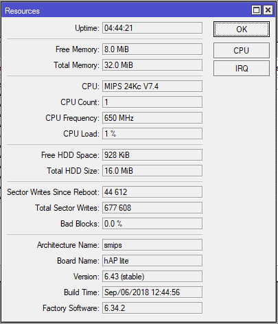  
    
  1. Sebelum mendownload RouterOS yang baru, lihat dulu arsitektur prosesornya. Cara lihatnya sama di **system > resource > Architecture name** atau bisa juga di title bar winbox, posisinya ada di paling ujung dan didalam kurung.  
      
  2. Setelah tau Arch nya, sekarang bisa download RouterOS nya di mikrotik.com/download  
  3. Cari versi yang diinginkan dan Arch yang sesuai lalu download. filenya harus ber ekstensi ***.npk**  
    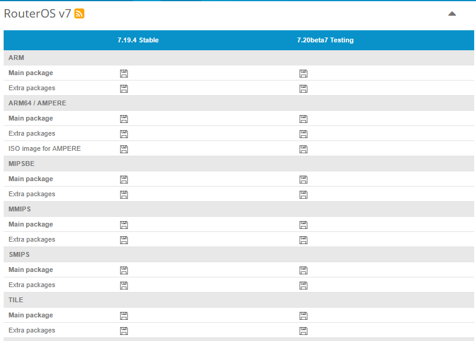  
  5. Jika sudah selesai, di File Explorer bagian Address Bar, isi dengan ftp://(ip mikrotik)  
    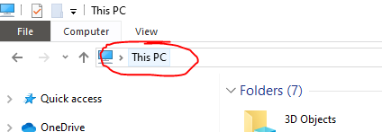  
  6. Nanti akan ada pop up untuk memasukan username dan password. Masukan username dan password lalu klil log on.  
    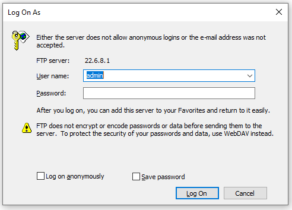  
  7. Jika sudah terhubung, copy/drag file RouterOS yang telah didownload tadi dari Windows ke Mikrotik. Pastikan storange cukup.  
    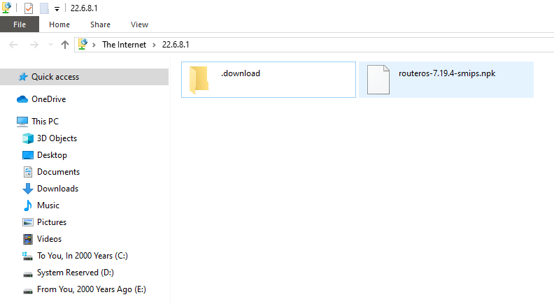  
  8. Selain menggunakan **WinExplor**, kita juga bisa mengunakan **FileZia** ataupun **Winbox**  
  9. Jika mengunakan Winbox, bisa pergi ke **Files > upload > cari dan pilih RouterOS** yang telah didownload  
  10. Jika file sudah berhasil masuk ke Mikrotik, Selanjutnya kita tinggal reboot Mikrotiknya saja **System > reboot**  
  11. Tunggu sampai proses reboot selesai dan login kembali  
  12. Untuk cek hasilnya, bisa dilihat di **System > resource** atau di title bar Winboxnya.  
    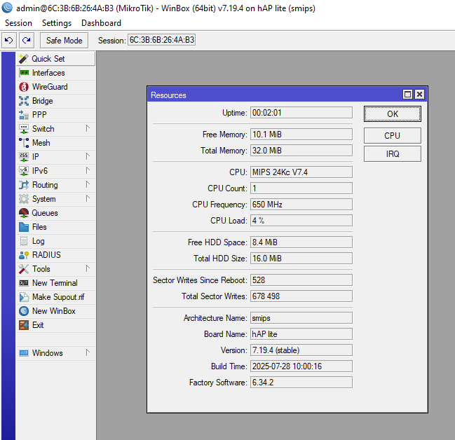  

**B. Secara Otomatis**  
    Berikut cara upgrade mikrotik secara otomatis  
  1. Pergi ke **system > packages**  
  2. Pilih **Check for Update**  
     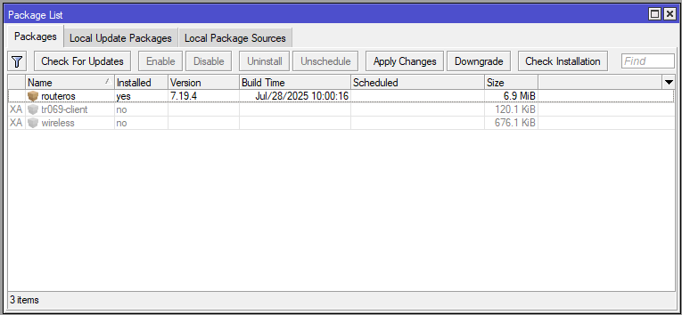  
  3. Disini ada beberapa versi, kita bisa pilih mulai dari yang stable, long term, development sampai yang testing.  
  4. Pilih versi yang diinginkan.  
  5. Klik download&install, pastikan router terkoneksi ke internet.  
     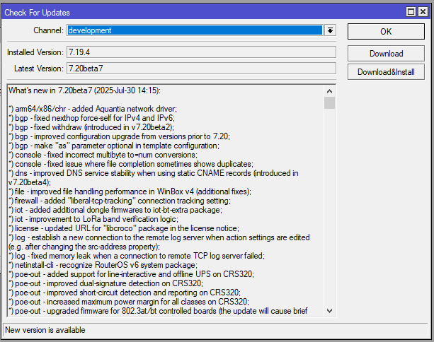  
  6. Tunggu hingga proses download selesai dan nanti akan reboot secara otomatis  
  7. Dan sekarang versi RouterOS sudah upgrade.  
      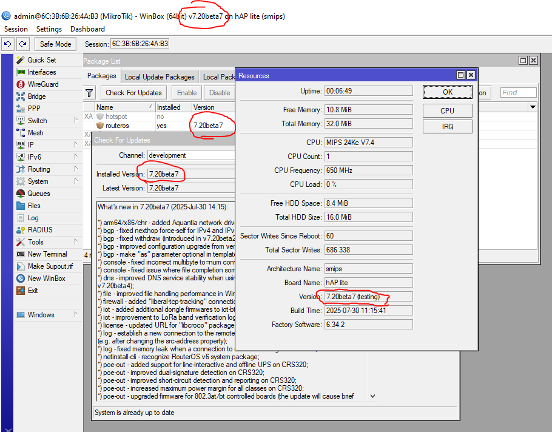  

# Downgrade RouterOS
  1. Download dulu versi yang lebih lama untuk melakukan downgrade  
  2. Setelah selesai, pindahkan file ROuterOS yang baru di download ke RouterOS seperti tadi mentransfer file saat akan upgrade. Yang bisa melalui WinExplor, Winbox ataupun FileZia  
  3. Setelah selesai, buka winbox dan pergi ke **system > packages**  
     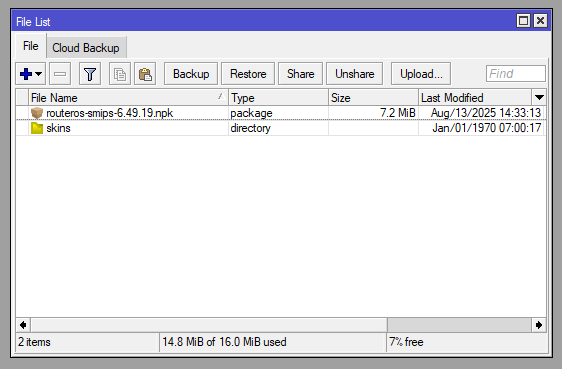  
  4. Klik **Downgrade**, nanti akan ada pop up konfirmasi, pilih **OK** aja.  
     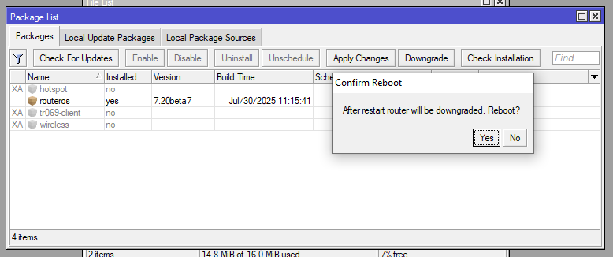  
  5. System akan otomatis reboot dan start otomatis.  
  6. Cek versinya jika masi belum yakin  
     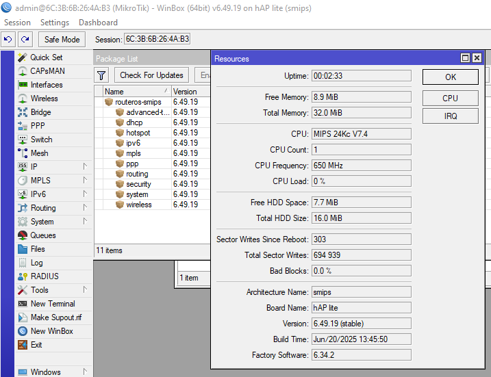  

# Package Management
  
