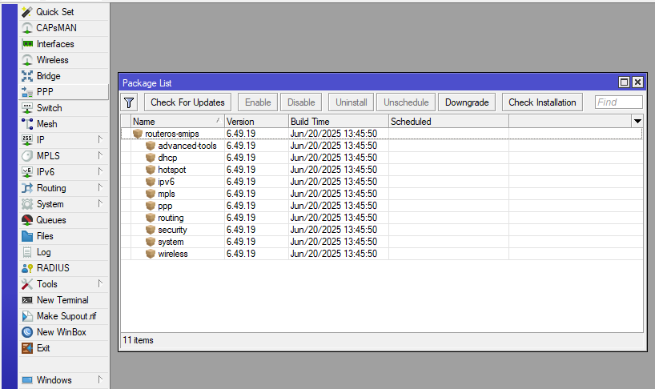
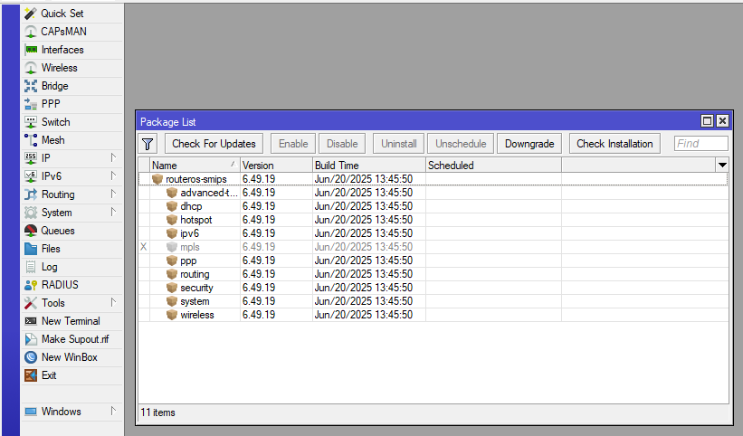
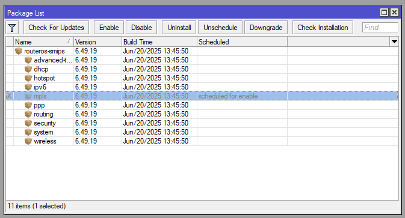
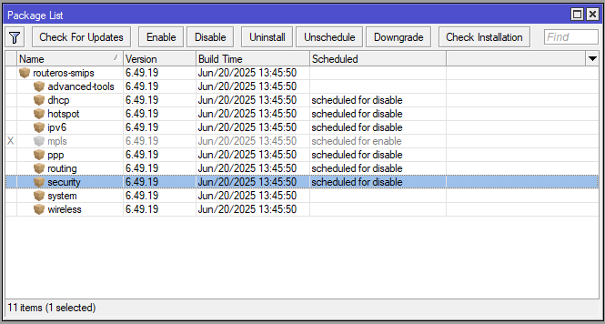
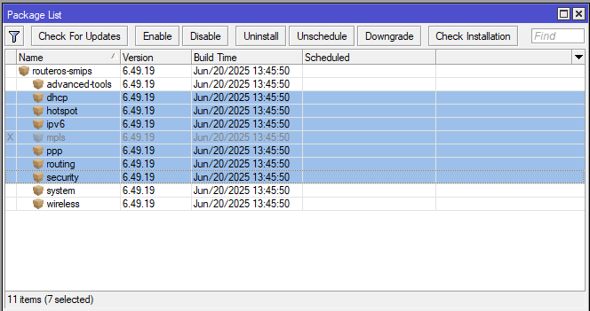
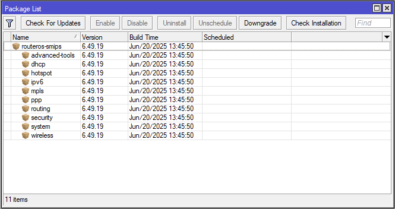
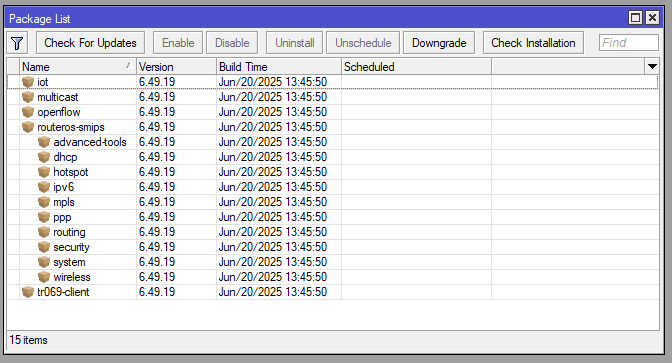
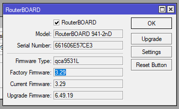

# LAB-9-Upgrade-Router-OS-Downgrade-Router-OS-Package-management-extra-packages
Rabu 13 Agustus 2025

**Siswa mampu melakukan :**  
- Upgrade Router OS,  
- Downgrade Router OS,  
- Package management,  
- Extra packages,   
- RouterBOOT  

# Upgrade RouterOS
**A. Secara Manual**  
        Disini saya akan upgrade RouterOS versi 6.42 ke 7.19. Versi RouterOS bisa dilihat dari **System > Resource**  
        
  
    
  1. Sebelum mendownload RouterOS yang baru, lihat dulu arsitektur prosesornya. Cara lihatnya sama di **system > resource > Architecture name** atau bisa juga di title bar winbox, posisinya ada di paling ujung dan didalam kurung.  
      
  2. Setelah tau Arch nya, sekarang bisa download RouterOS nya di mikrotik.com/download  
  3. Cari versi yang diinginkan dan Arch yang sesuai lalu download. filenya harus ber ekstensi ***.npk**  
      
  5. Jika sudah selesai, di File Explorer bagian Address Bar, isi dengan ftp://(ip mikrotik)  
      
  6. Nanti akan ada pop up untuk memasukan username dan password. Masukan username dan password lalu klil log on.  
      
  7. Jika sudah terhubung, copy/drag file RouterOS yang telah didownload tadi dari Windows ke Mikrotik. Pastikan storange cukup.  
      
  8. Selain menggunakan **WinExplor**, kita juga bisa mengunakan **FileZia** ataupun **Winbox**  
  9. Jika mengunakan Winbox, bisa pergi ke **Files > upload > cari dan pilih RouterOS** yang telah didownload  
  10. Jika file sudah berhasil masuk ke Mikrotik, Selanjutnya kita tinggal reboot Mikrotiknya saja **System > reboot**  
  11. Tunggu sampai proses reboot selesai dan login kembali  
  12. Untuk cek hasilnya, bisa dilihat di **System > resource** atau di title bar Winboxnya.  
      

**B. Secara Otomatis**  
    Berikut cara upgrade mikrotik secara otomatis  
  1. Pergi ke **system > packages**  
  2. Pilih **Check for Update**  
       
  3. Disini ada beberapa versi, kita bisa pilih mulai dari yang stable, long term, development sampai yang testing.  
  4. Pilih versi yang diinginkan.  
  5. Klik download&install, pastikan router terkoneksi ke internet.  
       
  6. Tunggu hingga proses download selesai dan nanti akan reboot secara otomatis  
  7. Dan sekarang versi RouterOS sudah upgrade.  
        

# Downgrade RouterOS
  1. Download dulu versi yang lebih lama untuk melakukan downgrade  
  2. Setelah selesai, pindahkan file ROuterOS yang baru di download ke RouterOS seperti tadi mentransfer file saat akan upgrade. Yang bisa melalui WinExplor, Winbox ataupun FileZia  
  3. Setelah selesai, buka winbox dan pergi ke **system > packages**  
       
  4. Klik **Downgrade**, nanti akan ada pop up konfirmasi, pilih **OK** aja.  
       
  5. System akan otomatis reboot dan start otomatis.  
  6. Cek versinya jika masi belum yakin  
       

# Package Management  
Berada di **system > packages**  
    
  1. Disable
        Menjadwalkan paket supaya dimatikan setelah reboot berikutnya, setelahnya fitur yang ada di paket itu tidak akan bisa di akses. Jika paket berhasil di disable, paket akan berubah menjadi abu-abu.  
     
       
       
  2. Enable  
        Menjadwalkan paket supaya dinyalakan setelah reboot berikutnya.  

       
  4. Downgrade  
        Menurunkan versi RouterOS ke versi paling lama yang ada di dalam storage Mikrotik.  
  6. Uninstall  
        Menghapus paket yang terinstall supaya terhapus di reboot selanjutnya.  
  8. Unschedule  
        Menghapus jadwal perubahan yang telah dibuat sebelumnya.
     
     

# Extra Package  
Extra packages adalah modul tambahan yang dapat diinstal di RouterOS untuk menambah fungsi atau dukungan tertentu yang tidak tersedia pada paket bawaan. Untuk memasang Extra packages caranya sama aja dengan Upgrade Mikrotik. Bisa dilihat di gambar dibawah ini, extra packages untuk smips.  
  
  
  
  

Terlihat, bahwa setelah menginstall extra packages, ada packages yang baru, antara lain:  
   1. IoT  
      Paket ini menyediakan dukungan bagi protokol dan teknologi yang digunakan pada perangkat IoT.  
   2. Multicast  
      Paket ini memungkinkan pengiriman data yang sama kepada banyak penerima.  
   3. Openflow  
      Paket ini menambahkan dukungan terhadap Software Defined Networking (SDN). Software Defined Network (SDN) adalah arsitektur jaringan yang memisahkan control plane (bagian yang menentukan bagaimana data mengalir).  
   4. tr069-client  
      Paket ini berfungsi untuk remote management perangkat router menggunakan protokol TR-069. TR-069 dapat digunakan untuk berbagai keperluan, seperti pertukaran data antar perangkat, penyimpanan data dalam basis data, atau penyediaan antarmuka web untuk data  

# RouterBOOT
RouterBOOT adalah firmware bawaan pada perangkat MikroTik yang berfungsi sebagai bootloader.  
**- RouterBOARD reset Button**  
ROuteherBOOT reset button ada 3 fungsi,  
1. Tahan tombol selagi boot sampai LED light mulai berkedip. Lepaskan untuk mereset RouterOS configuration (total 5 detik).  
2. Tetap menahan 5 detik lebih lama, LED light menyala tapi tidak berkedip, lepaskan untuk menyalakan CAP mode (total 10 detik).  
3. Atau tetap menahan tombol 5 detik lebih lama lagi sampai LED Light mati, lalu lepaskan tombol untuk membuat RouterBOARD tampil di Netinstall servers (total 15 detik).  
**- Configuration**  
   Untuk perangkat RouterBOARD yang ada fitur serial console connector. Bisa mengakses RouterBOOT loaded configuration menu. RouterBOARD serial ports terkonfigurasi ke 115200bit/s. 0 data bits. 1 stop bit. no parity. Disarankan untuk mematikan hardware flow control.  
   Contoh tampilan menu dari RouterBOOT 3.19  

           RouterBOOT booter 3.19

        CCR1009-8G-1S-1S+

        CPU frequency: 1200 MHz
          Memory size: 2048 MiB
            NAND size: 128 MiB
            NAND partitions: 2

        Press any key within 2 seconds to enter setup

        RouterBOOT-3.19
        What do you want to configure?
           d - boot delay
           k - boot key
           s - serial console
           n - silent boot
           o - boot device
           f - cpu frequency
           r - reset booter configuration
           e - format nand
           w - repartition nand
           y - active partition
           g - upgrade firmware
           i - board info
           p - boot protocol
           b - booter options
           t - do memory testing

**- Simple Upgrade**  
RouterBOOT bisa di upgrade dari RouterOS,  
jalankan command,  

                system routerboard upgrade
Lalu reboot router untuk apply the upgrade  

                system reboot

**- Cek versi RouterBOOT**  

                system routerboard print
Atau jika di GUI bisa pergi ke **system > RouterBOARD**  
  
  

# Kesimpulan  
Upgrade, downgrade, menegement package dan extra package di RouterOS dilakukan untuk menyesuaikan fungsi router sesuai kebutuhan. Upgrade ilakukan untuk mendapat kan pembaruan fitur, downgrade dilakukan untuk kembali ke versi sebelumnya jika terjadi masalah atau tidak kompatibel, package management yang dapat mematikan dan menyalakan paket sesuai kebutuhan, dan extra packages untuk memperluas kapabilitas router di luar fungsi standar.  
